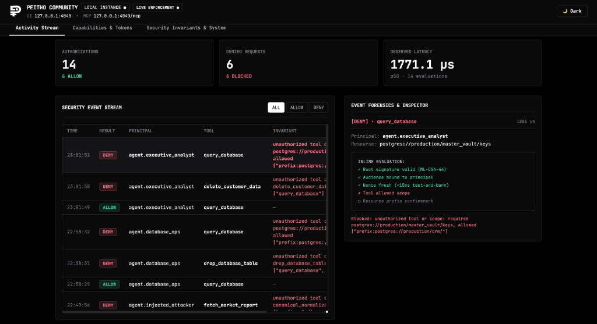
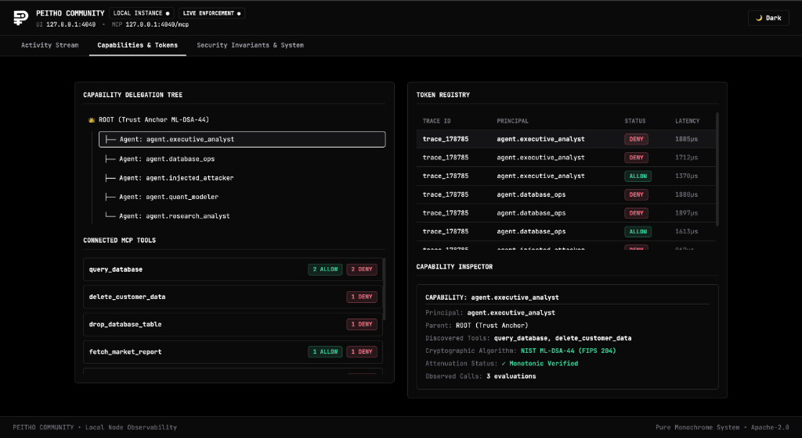

<div align="center">

# PeithoSecure

### **The Post-Quantum Authorization Kernel & Security Microscope for Autonomous AI Agents**

[](LICENSE)
[](https://www.rust-lang.org)
[](https://pypi.org/project/peitho/)
[](https://www.npmjs.com/package/@peithosecure/sdk)
[](https://csrc.nist.gov/pubs/fips/204/final)
[]()

<br/>

**Peitho is a high-performance, post-quantum cryptographic execution boundary and live observability instrument for AI agents and Model Context Protocol (MCP) tool calls.**

*Peitho prevents unauthorized AI-generated actions from crossing the tool authorization boundary.*
*Prompt injection can influence what an agent asks for. It cannot grant the agent authority it doesn't possess.*

<br/>

[Quickstart](#quickstart-in-30-seconds) •
[How It Works](#how-it-works) •
[Desktop & IDE Integration](#desktop-app--ide-integration) •
[SDKs](#python--typescript-sdks) •
[Live Dashboard](#live-developer-dashboard) •
[Formal Invariants](#the-18-formal-security-invariants)

</div>

---

## The AI Security Crisis: Why "Guardrails" Fail

Today, developers give autonomous AI agents **god-mode API keys and raw database credentials**. 

```
Model Output (LLM) ──► "Do X" ──► Agent requests X ──► [ PEITHO KERNEL ]
                                                               │
                                               "Does this capability authorize X?"
                                                               │
                                                ┌──────────────┴──────────────┐
                                                ▼                             ▼
                                           YES (Allowed)                 NO (Denied)
                                                │                             │
                                        Tool / Database                   Hard Block
```

### Why Peitho is Fundamentally Different:
* **Zero Trust in Model Behavior**: We assume the LLM *will* hallucinate, be tricked by prompt injections, or misread user intent.
* **Deterministic Enforcement at the Authorization Boundary**: An agent cannot execute a tool unless it carries a cryptographically valid, monotonic **NIST ML-DSA-44 signed capability token**.
* **Model-Agnostic**: Peitho enforces authorization deterministically at the tool boundary rather than relying on model behavior or inspecting prompt text.
* **Sub-Millisecond Hot Path**: Evaluates signatures, resource prefixes, single-use nonces, and TTLs in **$<50\,\mu\text{s}$** without external database lookups.

---

## Quickstart in 30 Seconds

### 1. Install Peitho CLI
```bash
# Via Cargo
cargo install peitho-cli

# Or One-Line Install (macOS / Linux)
curl -fsSL https://peithosecure.com/install.sh | sh
```

### 2. Start the Local Security Gateway & Dashboard
```bash
peitho dev --port 4040
```
Open **[http://127.0.0.1:4040](http://127.0.0.1:4040)** in your browser to view your live security stream.

### 3. Run the Autonomous Swarm Laboratory
```bash
# In another terminal, run the live multi-agent simulation
python3 examples/live_agent_lab/interactive_agent_swarm.py
```
Watch your terminal execute multi-agent prompts and adversarial injection attacks while your browser displays the real-time cryptographic traces!

---

## Desktop App & IDE Integration

Peitho acts as a transparent, high-speed security shim for any LLM desktop client or IDE supporting the Model Context Protocol (MCP).

### 1. Claude Desktop Integration (`claude_desktop_config.json`)
Shield local filesystem, Postgres, or terminal MCP servers:
```json
{
  "mcpServers": {
    "secure-filesystem": {
      "command": "peitho",
      "args": [
        "wrap",
        "--target", "npx -y @modelcontextprotocol/server-filesystem /Users/me/Projects",
        "--token-file", "/Users/me/.peitho/claude_readonly.bin"
      ]
    }
  }
}
```

### 2. Cursor IDE & Windsurf
Point your Cursor MCP settings directly to the local streamable gateway:
```
http://127.0.0.1:4040/mcp
```

*(See [docs/IDE_AND_DESKTOP_INTEGRATION.md](docs/IDE_AND_DESKTOP_INTEGRATION.md) for detailed IDE setup guides).*

---

## Python & TypeScript SDKs

### Python SDK (`peitho`)
```bash
pip install peitho
```

```python
from peitho import generate_keypair, CapabilityToken, shield

# 1. Generate NIST ML-DSA-44 Keypair
keys = generate_keypair()

# 2. Issue Bounded Capability Token
research_token = CapabilityToken.create_root(
    token_id="session-analyst-01",
    public_key=keys.public_key,
    secret_key=keys.secret_key,
    allowed_tools=["search_knowledge", "fetch_report"],
    resource_prefix="s3://enterprise/public/",
    read_only=True,
    expires_at=int(time.time()) + 3600
)

# 3. Shield Agent Functions
@shield(token=research_token)
def fetch_report(uri: str):
    # Calls outside s3://enterprise/public/ or write mutations are instantly blocked!
    return download_from_s3(uri)
```

---

### TypeScript / Node.js SDK (`@peithosecure/sdk`)
```bash
npm install @peithosecure/sdk
```

```typescript
import { PeithoClient, shield } from '@peithosecure/sdk';

const client = new PeithoClient({ gatewayUrl: 'http://127.0.0.1:4040/mcp' });

// Wrap agent tool invocations with post-quantum capability tokens
const protectedSearch = shield(async (query: string) => {
  return await vectorStore.search(query);
}, { tokenHex: agentTokenHex });
```

---

## Live Developer Dashboard

When running `peitho dev`, navigating to `http://127.0.0.1:4040` gives you a pure, high-signal developer microscope:

<div align="center">



*Live cryptographic activity stream: monitoring real-time agent tool executions, sub-millisecond latencies, and blocked adversarial prompt injections.*

<br/>



*Live capability delegation tree: dynamic tracking of multi-agent swarm hierarchies, active post-quantum token scopes, and connected MCP tool boundaries.*

</div>

<br/>

| Tab | Purpose | What You See |
| :--- | :--- | :--- |
| **`Activity Stream`** | Live Observability & Forensics | Real-time event log, latency counters, and granular forensic evaluations displaying exact violated invariant rules. |
| **`Capabilities & Tokens`** | Topology & Trust Hierarchy | Live parent-child **Capability Delegation Tree**, active token registry, and connected MCP tool boundaries. |
| **`Security Invariants & System`** | Mathematical Formal Proofs | All 18 formal security invariants ($P-001 \rightarrow P-018$) with test harness mapping and runtime diagnostics. |

---

## The 18 Formal Security Invariants

Peitho enforces 18 mathematically provable invariants across all delegations:

| ID | Invariant | Mathematical Formula | Enforcement Engine |
| :--- | :--- | :--- | :--- |
| **P-001** | Root Authority Authenticity | $\text{VerifyRoot}(T) \equiv \text{ML-DSA-44-Verify}$ | Post-quantum asymmetric verification |
| **P-002** | Monotonic Attenuation | $\text{Authority}(C_k) \subseteq \text{Authority}(C_{k-1})$ | Monotonic caveat narrowing |
| **P-003** | Cross-Tenant Isolation | $\text{Tenant}(A) \neq \text{Tenant}(B) \implies A \cap B = \emptyset$ | Cryptographic keypair isolation |
| **P-004** | Resource Confinement | $R_{\text{target}} \sqsubseteq R_{\text{prefix}}$ | Path traversal & prefix normalization |
| **P-005** | Tool Scope Confinement | $\text{Tool}_{\text{req}} \in \text{Tools}_{\text{allowed}}$ | Strict tool whitelist verification |
| **P-006** | Budget Confinement | $\text{Cost}(\text{Req}) \le \text{Budget}_{\text{rem}}$ | Monotonic cost decrement |
| **P-007** | Single-Use Replay Resistance | $\text{Nonce} \in \text{BurnedSet} \implies \text{DENY}$ | Test-and-burn atomic nonce cache |
| **P-008** | Revocation Precedence | $\text{IsRevoked}(T_{\text{id}}) \implies \text{DENY}$ | Sub-microsecond local tombstone checks |
| **P-009** | Monotonic Crash Durability | $\text{Recovered} \subseteq \text{PreCrash}$ | Atomic POSIX state durability |
| **P-010** | Profile Immutability | $\text{Profile} \in \{\text{Fips}, \text{Swarm}\} \wedge \text{Tamper} \implies \text{DENY}$ | Discriminant tampering rejection |
| **P-011** | Wire Format Integrity | $\text{Len}(T) \le 16\text{KB} \wedge \text{Magic}(T) == \text{PEITHO}$ | Magic header & size boundary suites |
| **P-012** | Session Confinement | $\text{Session}(\text{Req}) == \text{Session}(T)$ | Session ID & Audience isolation |
| **P-013** | Downstream Equivalence | $\text{Authorized}(\text{Req}) \implies \text{SameResource}_{\text{class}}$ | Canonical semantic mapping equivalence |
| **P-014** | Side-Effect Provenance | $\text{DiscreteSideEffect} \implies \text{Capability}$ | State changes require explicit tokens |
| **P-015** | Byzantine Node Containment | $\text{Compromised}(B) \not\implies \text{Forge}(C)$ | Zero forgeability across untrusted nodes |
| **P-016** | Key Compromise Recovery | $\text{Decommission}(V_1) \implies \text{DENY}(V_1)$ | Epoch bump and instant key revocation |
| **P-017** | At-Most-Once Authorization | $\text{Single-use authorization boundary}$ | Test-and-burn atomic verification |
| **P-018** | Zero Info-Flow Leakage | $\text{InfoFlow}(\text{Req}) \subseteq \text{AllowedDisclosure}$ | Uniform error oracle $(-32001)$ |

*(See [docs/INVARIANTS.md](docs/INVARIANTS.md) for mathematical proofs and property test suites).*

---

## Open Core Architecture & Commercial Roadmap

> *"Scale is a consequence. Authority is the product."*

```
  COMMUNITY (OPEN SOURCE)                          ENTERPRISE (COMMERCIAL ROADMAP)
   "I need to protect my agent."                    "I need to control organizational authority."
               │                                                      │
               ▼                                                      ▼
     ┌───────────────────┐                         ┌─────────────────────────────────────┐
     │  PEITHO KERNEL    │                         │      PEITHO CENTRAL AUTHORITY       │
     │  + LOCAL DASHBOARD│                         │   Policy • Identity • KMS • SIEM    │
     └─────────┬─────────┘                         └──────────────────┬──────────────────┘
               │                                                      │
        ┌──────┴──────┐                             ┌─────────────────┼─────────────────┐
        ▼             ▼                             ▼                 ▼                 ▼
     Agent A       Agent B                      Cluster A         Cluster B         Cluster C
   (Local Dev)   (Local Test)                  (Fleet Node)      (Fleet Node)      (Fleet Node)
```

| Layer / Feature | Community Edition (Apache 2.0) | Team & Enterprise Edition (Roadmap) |
| :--- | :--- | :--- |
| **Core Value** | Protecting Individual Agents & Local Swarms | Managing & Auditing Organizational Authority |
| **Deployment Model** | Single Node / Local Machine (`127.0.0.1:4040`) | Cloud VPC Mesh / Distributed Multi-Cluster |
| **Cryptographic Kernel** | NIST ML-DSA-44 (FIPS 204) & ML-KEM-768 | NIST ML-DSA-44 + Cloud KMS / Hardware HSM |
| **Token Verification** | Local $<50\,\mu\text{s}$ CPU Evaluation | Distributed $<50\,\mu\text{s}$ Kernel + Sync Mesh |
| **Observability** | Local Real-Time Dashboard & Forensic UI | Enterprise SIEM Streaming (Datadog, Splunk, S3) |
| **Fleet Policy Governance** | Code-Defined Python / TypeScript Tokens | Centralized Organization Policy Engine |
| **Incident Response** | Local Ephemeral Tombstone Cache | Subtree Instant Revocation Across Fleets |
| **Identity & Access** | Local Keypair Genesis | Enterprise SSO / SAML / SCIM / Organization RBAC |
| **Compliance Evidence** | Local Test Harness Audit Reports | Cryptographic Side-Effect Audit Trails |

---

## Contributing & Community

Contributions are welcome! Please see [CONTRIBUTING.md](CONTRIBUTING.md) for details on code style, property testing, and PR requirements.

* **GitHub Discussions**: Ask questions and share feedback.
* **Issues**: Report bugs or suggest new MCP tool interceptors.

---

<div align="center">

**Built for the global AI developer community.**

*PeithoSecure is open source software released under the [Apache 2.0 License](LICENSE).*

</div>
