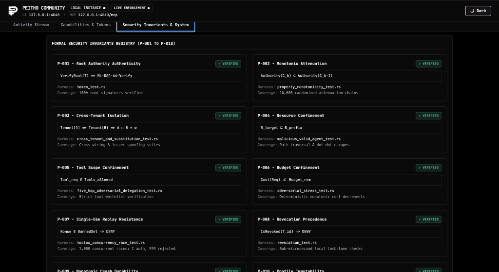
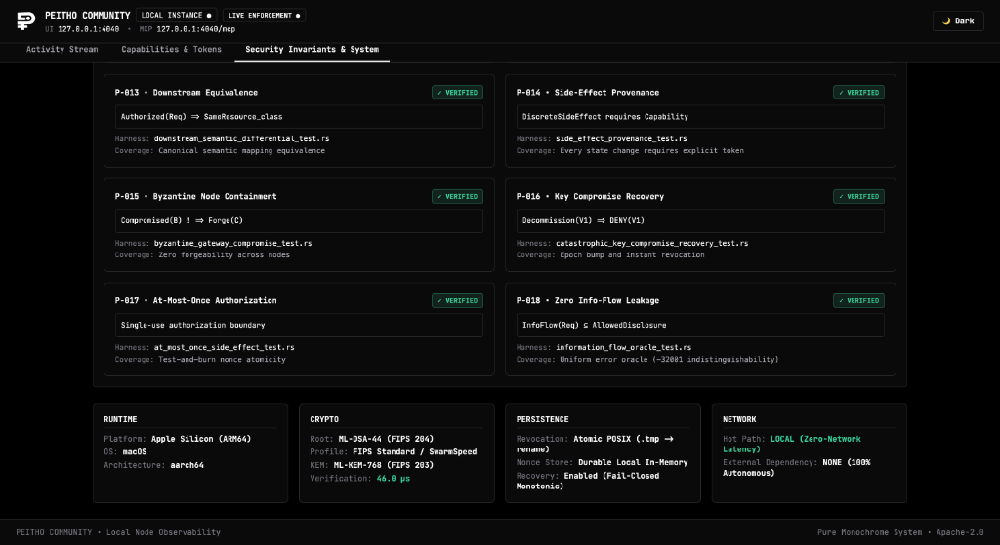

# 🔬 Peitho Developer Dashboard Guide

The Peitho Dashboard (`http://127.0.0.1:4040`) is a **developer security microscope** that turns invisible AI agent tool executions into crisp, real-time cryptographic traces.

<div align="center">


*Figure 1: Real-time telemetry stream showing 14 authorizations, allowed queries, and blocked prompt injection & DB destruction attempts.*

</div>

---

## 🧭 Dashboard Architecture: The 3 Core Views

The dashboard is structured around 3 high-signal developer views:
1. **Activity Stream** (What happened?)
2. **Capabilities & Tokens** (What authority exists?)
3. **Security Invariants & System** (Why can I trust this?)

---

## 1. 📊 Activity Stream (Live Observability & Forensics)

The Activity Stream is the primary real-time monitoring view. It functions like Wireshark for autonomous AI agent tool calls.

### Key Elements:
* **Top Metric Cards**:
  * **`AUTHORIZATIONS`**: Total tool evaluations processed by the local kernel.
  * **`DENIED REQUESTS`**: Intercepted attacks and out-of-scope invocations.
  * **`OBSERVED LATENCY`**: Native hardware execution time (p50 measurement).
* **Security Event Stream Table**:
  * **`TIME`**: Precise timestamp down to the second.
  * **`RESULT`**: `ALLOW` (Green badge) or `DENY` (Red badge).
  * **`PRINCIPAL`**: The agent identity (e.g., `agent.executive_analyst`, `agent.database_ops`, `agent.injected_attacker`).
  * **`TOOL`**: The invoked tool function (e.g., `query_database`, `drop_database_table`, `execute_wire_transfer`).
  * **`INVARIANT`**: The violated security rule (e.g., `P-004 Resource Confinement`).
* **Event Forensics & Inspector (Right Panel)**:
  * Clicking any row displays the full cryptographic checklist:
    * `✓ Root signature valid (NIST ML-DSA-44)`
    * `✓ Audience bound to principal`
    * `✓ Nonce fresh (<15ns test-and-burn)`
    * `✗ Tool allowed scope (P-005)`
    * `○ Resource prefix confinement (P-004)`
  * Displays raw resource targets and failure diagnostic messages.

---

## 2. 👑 Capabilities & Tokens (Authority Topology)

This view visualizes who authorized what and how permissions flowed through the swarm.

<div align="center">


*Figure 2: Live Capability Delegation Tree mapping dynamic agent swarms under the Genesis Root.*

</div>

### Left Panel:
* **Capability Delegation Tree**:
  * Visualizes the live hierarchy from Genesis Root down to child and grandchild subagents:
    ```text
    👑 ROOT (Trust Anchor ML-DSA-44)
    ├── Agent: agent.executive_analyst
    ├── Agent: agent.database_ops
    ├── Agent: agent.injected_attacker
    ├── Agent: agent.quant_modeler
    └── Agent: agent.research_analyst
    ```
* **Connected MCP Tools**:
  * Dynamic list of all tools observed across the gateway with live allowed/denied counts.

### Right Panel:
* **Token Registry**:
  * In-memory registry of all active capability tokens, trace IDs, and execution latencies.
* **Capability Inspector**:
  * Deep cryptographic inspection of the selected token, including discovered tool whitelists, resource prefixes, and delegation depth.

---

## 3. 🛡️ Security Invariants & System (Formal Proofs)

This view provides transparent mathematical assurance that the local kernel is operating correctly.

<div align="center">



*Figure 3: Formal Mathematical Security Invariants Registry ($P-001 \rightarrow P-008$).*

<br/>



*Figure 4: Invariants ($P-013 \rightarrow P-018$) and zero-network, local post-quantum runtime diagnostics.*

</div>

### Key Elements:
* **Formal Invariants Registry ($P-001 \rightarrow P-018$)**:
  * 18 formal cards detailing the mathematical specification of each invariant, the enforcing Rust source file, the test harness, and verification coverage.
* **System Runtime Health**:
  * Real-time hardware diagnostics: Platform architecture (`aarch64` / Apple Silicon), Post-Quantum algorithms (`ML-DSA-44 / ML-KEM-768`), zero-allocation memory metrics, and zero-network hot path confirmation.

---

## 🌙 Theme & Sticky Navigation
* Click the **`🌙 Theme`** button in the top right to toggle between Dark Mode and Light Mode.
* The top navigation bar is pinned **stickily below the header**, so you can switch between views seamlessly from anywhere on the page!
